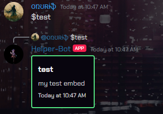

# JPWP-Bot

## Sources

[discord.py GitHub](https://github.com/Rapptz/discord.py)

[discord.py docs](https://discordpy.readthedocs.io/en/stable/ext/commands/api.html)

[discord developer portal](https://discord.com/developers/applications)

## Install library

```shell
pip install discord
```
or

```shell
pip install git+https://github.com/Rapptz/discord.py.git@master
```

## Task I
- prefix command
- bot answers with embed(with ping or without)
- embed contains: Title, Description, Timestamp(now)


